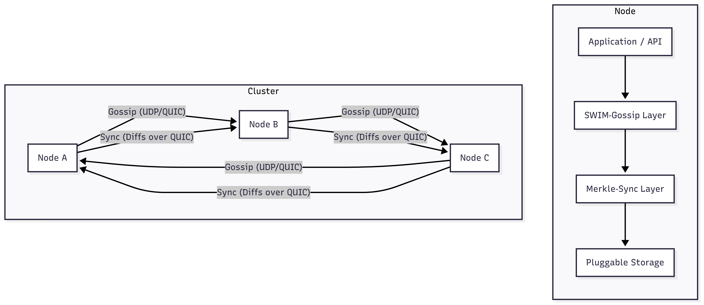

# Fringe

Fringe is a **distributed synchronization platform** purpose-built for edge computing environments. It combines efficient Merkle tree–based data synchronization with robust SWIM-style gossip membership and failure detection. This architecture enables lightweight, fault-tolerant, and eventually consistent data sharing across edge nodes with minimal coordination overhead.

---

## Features

- **SWIM-Style Gossip Membership**  
  Scalable, resilient cluster membership with periodic health checks and peer discovery.

- **Merkle Tree–Based Data Sync**  
  Efficient partial synchronization that transmits only differences between nodes.

- **Edge-First Architecture**  
  Designed for intermittently connected, bandwidth-constrained, and heterogeneous environments.

- **Rust CLI for Node Management**  
  Fast, reliable command-line interface for cluster operations.

- **Go Dashboard for Monitoring**  
  Real-time web interface for cluster state visualization.

- **Prometheus Metrics**  
  Comprehensive observability with metrics collection and monitoring.

---

## Architecture Overview



**Components:**

- **Membership Layer**  
  Periodically pings peers and uses indirect probes to maintain a dynamic view of the cluster.

- **Sync Layer**  
  On topology change or scheduled intervals, nodes compare Merkle tree hashes and exchange only the diffs.

- **CLI Layer**  
  Rust-based command-line interface for cluster management and data operations.

- **Dashboard Layer**  
  Go-based web dashboard for real-time cluster monitoring and visualization.

---

##  Quick Start

### Prerequisites

- Go 1.24+
- Rust 1.70+
- Git

### Installation

   ```

1. **Build the Rust CLI:**
   ```bash
   cd cli
   cargo build --release
   cd ..
   ```

### Starting a Cluster

1. **Start the first node (bootstrap):**
   ```bash
   go run cmd/edge/main.go --bootstrap --port 8080 --metrics-port 9090
   ```

2. **Start additional nodes:**
   ```bash
   go run cmd/edge/main.go --node 127.0.0.1:8080 --port 8081 --metrics-port 9091
   go run cmd/edge/main.go --node 127.0.0.1:8080 --port 8082 --metrics-port 9092
   ```

3. **Start the dashboard:**
   ```bash
   go run cmd/dashboard/main.go 8080
   ```

4. **Use the CLI to manage the cluster:**
   ```bash
   # List all nodes in the cluster
   ./cli/target/release/fringe-cli list --node 127.0.0.1:8080
   
   # Add data to a node
   ./cli/target/release/fringe-cli add --node 127.0.0.1:8080 --key config --value "{\"version\": 1}"
   
   # Get data from a node
   ./cli/target/release/fringe-cli get --node 127.0.0.1:8080 --key config
   
   # Sync data between nodes
   ./cli/target/release/fringe-cli sync --from 127.0.0.1:8080 --to 127.0.0.1:8081
   ```

---

## CLI Usage

### Node Management

```bash
# Start a new node
./cli/target/release/fringe-cli start --bootstrap --addr 127.0.0.1:8080

# Start a node and join existing cluster
./cli/target/release/fringe-cli start --join 127.0.0.1:8080 --addr 127.0.0.1:8081

# List all nodes in a cluster
./cli/target/release/fringe-cli list --node 127.0.0.1:8080

# Check node status
./cli/target/release/fringe-cli status --node 127.0.0.1:8080
```

### Data Operations

```bash
# Add data to a node
./cli/target/release/fringe-cli add --node 127.0.0.1:8080 --key sensor-data --value "{\"temp\": 25.5}"

# Get data from a node
./cli/target/release/fringe-cli get --node 127.0.0.1:8080 --key sensor-data

# Delete data from a node
./cli/target/release/fringe-cli delete --node 127.0.0.1:8080 --key sensor-data

# Sync data between nodes
./cli/target/release/fringe-cli sync --from 127.0.0.1:8080 --to 127.0.0.1:8081
```

---

## Dashboard

The dashboard provides a web interface for monitoring cluster state:

- **Main Dashboard:** `http://localhost:8080`
- **Metrics Endpoint:** `http://localhost:8080/metrics`
- **API Endpoints:**
  - `GET /api/clusters` - List all clusters
  - `GET /api/clusters/{name}` - Get cluster details
  - `GET /api/clusters/{name}/nodes` - Get cluster nodes
  - `GET /api/clusters/{name}/data` - Get cluster data
  - `POST /api/clusters/{name}/sync` - Trigger sync

### Dashboard Features

- Real-time cluster state visualization
- Node health monitoring
- Merkle tree hash display
- Data synchronization status
- Auto-refresh every 5 seconds
- Prometheus metrics integration

---

## Configuration

### Node Configuration

```bash
# Available flags for edge nodes
go run cmd/edge/main.go --help

# Bootstrap node
--bootstrap                    # Set as bootstrap node
--node <address>              # Join existing cluster
--port <port>                 # Node port (0 for random)
--metrics-port <port>         # Metrics endpoint port
```

### Dashboard Configuration

```bash
# Available flags for dashboard
go run cmd/dashboard/main.go --help

# Default port is 8080, can be overridden
go run cmd/dashboard/main.go 9090
```

---

## Monitoring & Metrics

### Prometheus Metrics

The system exposes comprehensive metrics:

- `fringe_cluster_size` - Current number of nodes in cluster
- `fringe_ping_latency_seconds` - Ping latency histogram
- `fringe_messages_total` - Total messages by type
- `fringe_dashboard_clusters_total` - Number of monitored clusters
- `fringe_dashboard_nodes_total` - Number of nodes by state

### Metrics Endpoints

- Node metrics: `http://localhost:9090/metrics`
- Dashboard metrics: `http://localhost:8080/metrics`

---

## Architecture Details

### SWIM Protocol Implementation

The SWIM (Scalable Weakly-consistent Infection-style Process Group Membership) protocol provides:

- **Periodic Pings:** Nodes ping random peers every 5 seconds
- **Indirect Probes:** Use other nodes to probe suspected failures
- **Piggybacked Updates:** Membership updates are piggybacked on ping messages
- **Failure Detection:** Automatic detection of failed nodes with configurable timeouts

### Merkle Tree Synchronization

The Merkle tree-based sync provides:

- **Efficient Diffs:** Only transmit differences between nodes
- **Hash-based Comparison:** Quick identification of data changes
- **Configurable Depth:** Adjustable tree depth for different use cases
- **Version Control:** Built-in versioning for data consistency

### Edge Optimization

The system is optimized for edge environments:

- **Bandwidth Efficient:** Minimal data transfer with diff-based sync
- **Fault Tolerant:** Handles intermittent connectivity
- **Resource Light:** Low memory and CPU footprint
- **Heterogeneous:** Works across different edge device types

---

## Testing

### Running Tests

```bash
# Run Go tests
go test ./...

# Run Rust tests
cd cli && cargo test
```

### Manual Testing

1. **Start a cluster:**
   ```bash
   # Terminal 1: Bootstrap node
   go run cmd/edge/main.go --bootstrap --port 8080
   
   # Terminal 2: Join node
   go run cmd/edge/main.go --node 127.0.0.1:8080 --port 8081
   
   # Terminal 3: Dashboard
   go run cmd/dashboard/main.go 8080
   ```

2. **Test data operations:**
   ```bash
   # Add data
   ./cli/target/release/fringe-cli add --node 127.0.0.1:8080 --key test --value "hello"
   
   # Verify sync
   ./cli/target/release/fringe-cli get --node 127.0.0.1:8081 --key test
   ```

---

## Use Cases

- **Sensor Data Synchronization:** Efficiently sync sensor readings across edge gateways
- **Configuration Management:** Propagate configuration changes across distributed systems
- **Offline-First Applications:** Enable applications that work offline with periodic sync
- **IoT Device Management:** Manage and monitor IoT devices in edge networks
- **Distributed Caching:** Share cache data across edge nodes with minimal overhead

---

